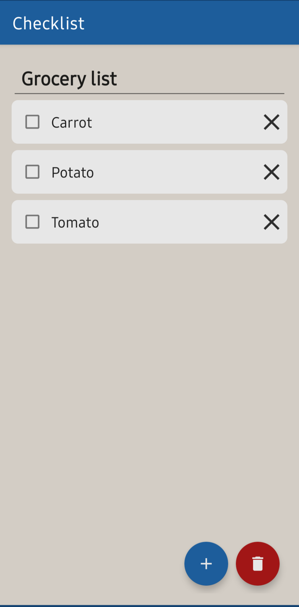
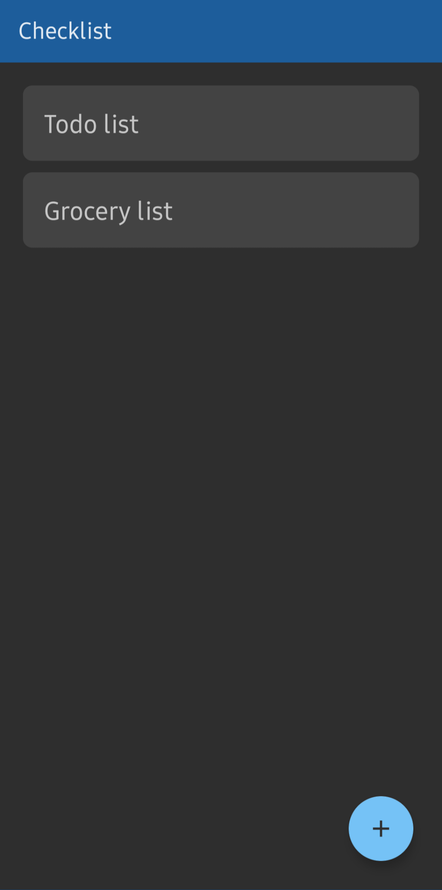
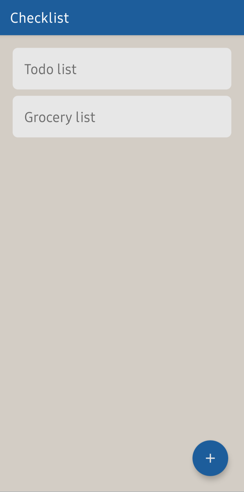
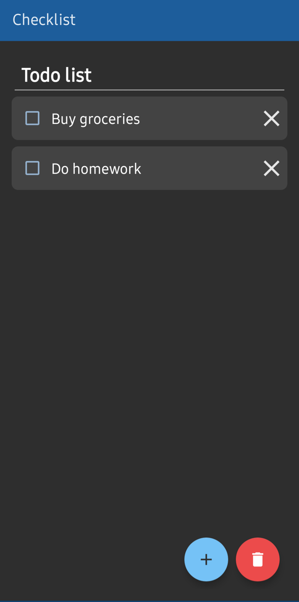

# An experimental Android app to store checklist

Checklist is an app that lets you create and store checklists. It is made as the final project for the [CS50x online course](https://cs50.harvard.edu) offered by Harvard University.

## Features

- Add, edit, and remove checklists and checklist items
- Auto-saved editting.
- Light and Dark theme based on device theme.

## Screenshots

Light theme | Dark theme
:--:|:--:
 | 
 | 